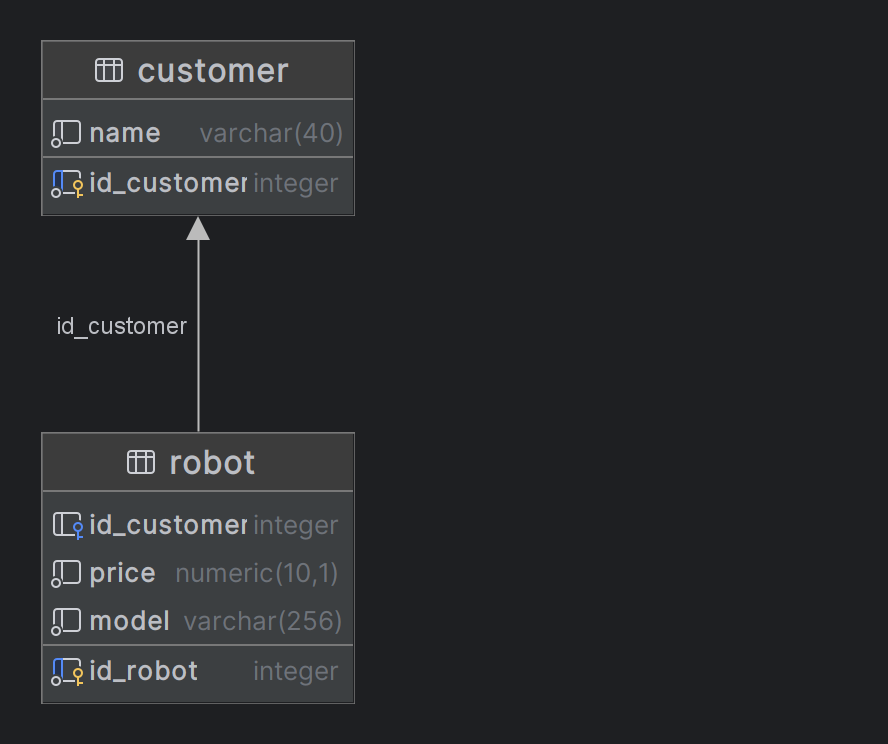

# Obchod robotů

## Popis
* Máme databázi obsahující tabulky `ROBOT` a `CUSTOMER`. V tabulce `ROBOT` ukládáme ID zákazníka, který ho zakoupil.

* Obchodní manažer chce zjistit, kolik peněz určitý zákazník utratil 
za nákup robota v definovaném časovém intervalu (od - do). 
Tedy na vstupu obdržíme CSV tabulku se jmény zákazníků a časovým rozsahem (od, do). 
Manažer požaduje, abychom zjistili celkovou částku, kterou zákazník utratil v tomto časovém intervalu, 
a vrátili mu tabulku ve formátu CSV, kde první sloupec bude jméno zákazníka 
a druhý sloupec celková suma nákupů. Např.

| name    | sum   |
|---------|-------|
| John Doe | 12000 |
| Bob Brown| 24000 |

## Řešení

Na ukládání vstupních a výstupních dat jsem vytvořil dvě pomocné, dočasné tabulky: `RES` a `CUST`. 
Dále mám funkci `get_user_sum()`, která na základě jména zákazníka a časového intervalu 
vrátí celkovou sumu nákupu pro tohoto zákazníka. 
Procedura `calculate_sum()` načte data z CSV souboru do tabulky `CUST`, 
pak pomocí kurzoru projde celou tabulku po řádcích 
a pro každý řádek zavolá funkci `get_user_sum()`. Výsledek vloží do tabulky `RES`.

Výslednou tabulku `RES` uložím do CSV souboru pomocí příkazu `COPY`.

## Ukázka použití 
Pro vstupní data ze soubor customers.csv bude výstup uložen do souboru res.csv

### Vstup (customers.csv):
| name |  from |  to |
| :--- | :--- | :--- |
| John Doe | 2023-01-01 | 2024-01-01 |
| Alice Johnson | 2024-01-01 | 2024-06-01 |
| Jane Smith | 2023-02-01 | 2024-06-01 |
| Bob Brown | 2024-06-20 | 2024-07-20 |
| Charlie Davis | 2023-09-10 | 2023-12-10 |

### Výstup (res.csv):
| name | sum |
| :--- | :--- |
| John Doe | 4000 |
| Alice Johnson | 4700 |
| Jane Smith | 9100 |
| Bob Brown | null |
| Charlie Davis | null |
